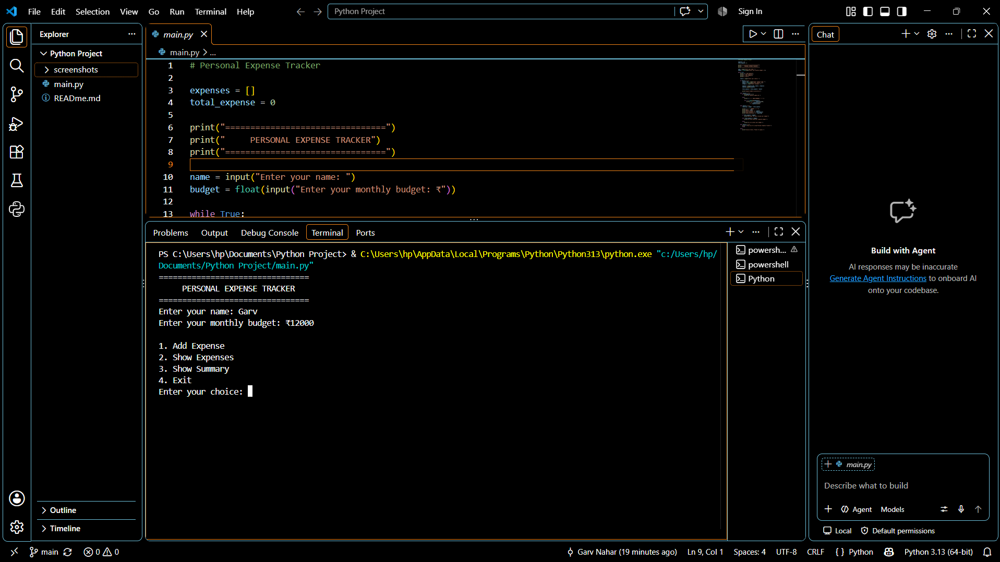
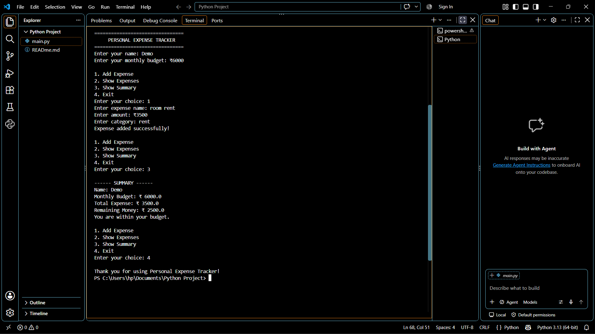

# Personal Expense Tracker

**Name:** Garv Nahar
**Registration No.:** 26MEI10041

Personal Expense Tracker is a small Python program for keeping track of expenses and a monthly budget.

I made this project to practice the basic Python topics I have learned, such as lists, loops, conditions, user input, and simple calculations.

---

## Project Structure

```text
personal-expense-tracker/
│
├── screenshots/
│   ├── main-menu.png
│   └── summary.png
│
├── main.py
└── README.md
```

`main.py` contains the program code.

The `screenshots` folder contains screenshots of the program while it is running.

`README.md` contains the project information and instructions.

---

## What This Project Does

The program starts by asking for:

* Name
* Monthly budget

After that, a menu is shown. From the menu, the user can:

1. Add an expense
2. See all expenses
3. Check the budget summary
4. Exit the program

For every expense, the program takes the expense name, amount, and category.

---

## Features

* Set a monthly budget
* Add multiple expenses
* Add an expense category
* View entered expenses
* Calculate total spending
* Calculate remaining money
* Check whether the budget has been crossed
* Simple terminal-based menu

---

## Python Concepts Used

This project uses basic Python concepts:

* Lists
* `while` loop
* `for` loop
* `if-elif-else`
* `input()`
* `print()`
* `len()`
* Arithmetic operations
* `break`

No external libraries are needed.

---

## Requirements

Python 3.x is required to run the program.

To check whether Python is installed:

```bash
python --version
```

On some systems, the command may be:

```bash
python3 --version
```

---

## Installation

Clone the repository:

```bash
git clone https://github.com/Garv-Nahar-cyber/personal-expense-tracker.git
```

Go to the project folder:

```bash
cd personal-expense-tracker
```

---

## Command Line

The program can be run directly from Command Prompt, PowerShell, or a terminal.

After cloning the repository and opening the project folder, run:

```bash
python main.py
```

If `python` is not recognized, try:

```bash
python3 main.py
```

### Example

```text
================================
     PERSONAL EXPENSE TRACKER
================================

Enter your name: Garv
Enter your monthly budget: ₹5000

1. Add Expense
2. Show Expenses
3. Show Summary
4. Exit

Enter your choice:
```

---

## Adding an Expense

Select option `1` from the menu.

The program will ask for three things:

```text
Enter expense name: Groceries
Enter amount: ₹800
Enter category: Food
```

After entering the details:

```text
Expense added successfully!
```

The expense is stored in the `expenses` list.

---

## Viewing Expenses

Select option `2` to see the expenses that have been entered.

For example:

```text
------ YOUR EXPENSES ------

1 . Groceries - ₹ 800.0 - Food
2 . Bus Pass - ₹ 500.0 - Travel
3 . Notebook - ₹ 120.0 - Education
```

If there are no expenses yet, it shows:

```text
No expenses added yet.
```

---

## Checking the Summary

Select option `3` to see the current budget information.

Example:

```text
------ SUMMARY ------

Name: Garv
Monthly Budget: ₹ 5000.0
Total Expense: ₹ 1420.0
Remaining Money: ₹ 3580.0

You are within your budget.
```

The remaining amount is calculated as:

```text
Remaining Money = Monthly Budget - Total Expense
```

The program also checks the total expense against the budget.

If the expense is greater than the budget:

```text
Warning: You have crossed your budget!
```

If the expense is exactly equal to the budget:

```text
You have used your complete budget.
```

Otherwise:

```text
You are within your budget.
```

---

## How the Program Works

The basic flow of the program is:

```text
Start
  ↓
Enter Name
  ↓
Enter Monthly Budget
  ↓
Show Menu
  ↓
Choose an Option
  ↓
Perform the Selected Operation
  ↓
Return to Menu
  ↓
Exit
```

The `while` loop keeps showing the menu until option `4` is selected.

---

## Data Storage

The expenses are stored in a Python list:

```python
expenses = []
```

When an expense is added, its details are stored together:

```text
[Expense Name, Amount, Category]
```

For example:

```text
["Groceries", 800, "Food"]
```

The program also keeps track of the total amount spent using:

```python
total_expense
```

---

## Screenshots

The screenshots from the program are available in the `screenshots` folder.

### Main Menu



### Expense Summary



---

## Limitations

There are a few things that this version does not do yet:

* Expenses are not saved after the program is closed.
* Existing expenses cannot be edited.
* Expenses cannot be deleted.
* There is no graphical interface.
* The program only provides basic budget calculations.

---

## What I Learned

While making this project, I got practice with taking input from the user, storing data in lists, using loops and conditions, and doing calculations in Python.

It also helped me understand how these basic concepts can be put together to make a small working program instead of using them separately.

---

## Future Improvements

Some things I could add to the project later are:

* Save expenses to a file
* Delete or edit expenses
* Add dates to expenses
* Search expenses by category
* Show category-wise spending
* Keep records for different months
* Add graphs for expenses
* Add a simple GUI
* Use a database for storing expenses

---

## Repository

GitHub repository:

https://github.com/Garv-Nahar-cyber/personal-expense-tracker

---

## Author

**Garv Nahar**

**Registration No.:** 26MEI10041

**VIT Bhopal University**

---

## Purpose

This project was made as a beginner Python project to practice programming fundamentals and build a simple application around a daily-life use case.
